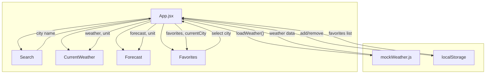
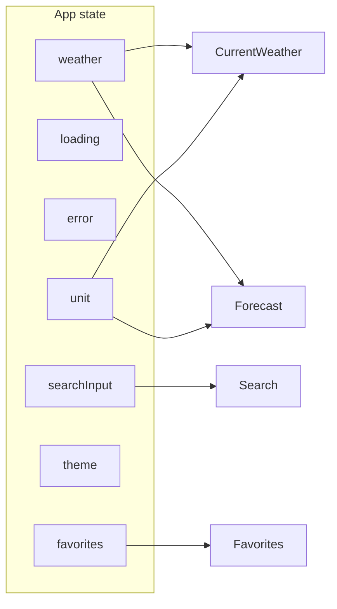
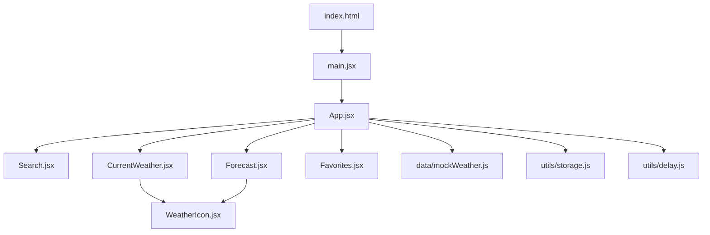

# Weather Dashboard – Mermaid Diagrams

View these in any Markdown viewer that supports Mermaid (e.g. GitHub, VS Code with Mermaid extension, or [mermaid.live](https://mermaid.live)).

---

## 1. Component & data flow



---

## 2. User flow (search → result)

```mermaid
flowchart LR
    A[User types city] --> B[Click Search]
    B --> C[Loading 0.7s]
    C --> D{Mock data?}
    D -->|Found| E[Show current + forecast]
    D -->|Not found| F[Show "City not found"]
    E --> G[Can add to Favorites]
    G --> H[Click favorite later]
    H --> E
```

---

## 3. App state (simplified)



---

## 4. File structure (high level)


